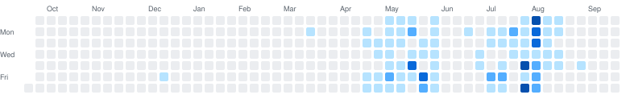

<h1 align="center">Hi 👋, I'm Cansın Cömert</h1>
<h3 align="center">Building AI systems where it's hard — clinical genomics, financial analytics, applied LLMs</h3>

  
  &nbsp;
  
  &nbsp;
  
  &nbsp;
  

---

<!-- ======================= -->
<!--        ABOUT ME         -->
<!-- ======================= -->

<h3 align="center">🚀 About Me</h3>

  🧬 &nbsp;I build <b>clinical genomics infrastructure</b> — FASTQ → VCF → annotation → LLM interpretation, end to end 
  🤖 &nbsp;MSc research on <b>LLMs for computational biology</b>: long-context variant reasoning, RAG ablations, quantization studies 
  📈 &nbsp;Also shipping <b>financial analytics</b> — a fund-market terminal with AI-driven insights across web, iOS and Android 
  🛠 &nbsp;Comfortable across the whole stack: Python pipelines, React frontends, Kotlin/Swift clients, Postgres underneath

---

<!-- ======================= -->
<!--       GITHUB STATS      -->
<!-- ======================= -->

<h3 align="center">📊 Real Numbers</h3>

  Counted straight from every default-branch history I have access to — private repos included, not just the public-facing graph.

<!-- STATS:START — generated by .github/workflows/update-stats.yml, do not edit by hand -->

  
  &nbsp;
  
  &nbsp;
  
  &nbsp;
  

<!-- STATS:END -->

---

<h3 align="center">📈 GitHub Stats</h3>

  

<h3 align="center">📈 Contribution Activity</h3>

  Includes private contributions. Regenerated daily from the GraphQL API — the public
  calendar services cache a stale, public-only figure.

  

  

---

<!-- ======================= -->
<!--        TECH STACK       -->
<!-- ======================= -->

<h3 align="center">🛠 Tech Stack</h3>

<!-- ======================= -->
<!--        LANGUAGES        -->
<!-- ======================= -->
<h4 align="center">💻 Languages</h4>

<table align="center">
  <tr>
    <td align="center" width="96">
       
      <b>Python</b>
    </td>
    <td align="center" width="96">
       
      <b>TypeScript</b>
    </td>
    <td align="center" width="96">
       
      <b>JavaScript</b>
    </td>
    <td align="center" width="96">
       
      <b>SQL</b>
    </td>
    <td align="center" width="96">
       
      <b>Kotlin</b>
    </td>
    <td align="center" width="96">
       
      <b>Swift</b>
    </td>
    <td align="center" width="96">
       
      <b>Java</b>
    </td>
    <td align="center" width="96">
       
      <b>Bash</b>
    </td>
  </tr>
</table>

<!-- ======================= -->
<!--     AI & LLM STACK      -->
<!-- ======================= -->
<h4 align="center">🤖 AI & LLM Engineering</h4>

<table align="center">
  <tr>
    <td align="center" width="96">
       
      <b>PyTorch</b>
    </td>
    <td align="center" width="96">
       
      <b>Hugging Face</b>
    </td>
    <td align="center" width="96">
       
      <b>Ollama</b>
    </td>
    <td align="center" width="96">
       
      <b>Claude</b>
    </td>
    <td align="center" width="96">
       
      <b>RAG</b>
    </td>
    <td align="center" width="96">
       
      <b>ChromaDB</b>
    </td>
    <td align="center" width="96">
       
      <b>NumPy</b>
    </td>
    <td align="center" width="96">
       
      <b>Matplotlib</b>
    </td>
  </tr>
</table>

<!-- ======================= -->
<!--   GENOMICS & DATA       -->
<!-- ======================= -->
<h4 align="center">🧬 Genomics & Data Engineering</h4>

<table align="center">
  <tr>
    <td align="center" width="96">
       
      <b>VCF / vcfpy</b>
    </td>
    <td align="center" width="96">
       
      <b>Ensembl VEP</b>
    </td>
    <td align="center" width="96">
       
      <b>Exomiser</b>
    </td>
    <td align="center" width="96">
       
      <b>PostgreSQL</b>
    </td>
    <td align="center" width="96">
       
      <b>Supabase</b>
    </td>
    <td align="center" width="96">
       
      <b>SQLite</b>
    </td>
  </tr>
</table>

<!-- ======================= -->
<!--     WEB & MOBILE        -->
<!-- ======================= -->
<h4 align="center">🌐 Web & Mobile</h4>

<table align="center">
  <tr>
    <td align="center" width="96">
       
      <b>React</b>
    </td>
    <td align="center" width="96">
       
      <b>Vite</b>
    </td>
    <td align="center" width="96">
       
      <b>Node.js</b>
    </td>
    <td align="center" width="96">
       
      <b>Jest</b>
    </td>
    <td align="center" width="96">
       
      <b>HTML5</b>
    </td>
    <td align="center" width="96">
       
      <b>CSS3</b>
    </td>
    <td align="center" width="96">
       
      <b>Compose</b>
    </td>
    <td align="center" width="96">
       
      <b>SwiftUI</b>
    </td>
  </tr>
</table>

<!-- ======================= -->
<!--   INFRA & TOOLING       -->
<!-- ======================= -->
<h4 align="center">☁️ Infrastructure & Tooling</h4>

<table align="center">
  <tr>
    <td align="center" width="96">
       
      <b>Docker</b>
    </td>
    <td align="center" width="96">
       
      <b>Vercel</b>
    </td>
    <td align="center" width="96">
       
      <b>Git</b>
    </td>
    <td align="center" width="96">
       
      <b>GitHub</b>
    </td>
    <td align="center" width="96">
       
      <b>Actions</b>
    </td>
    <td align="center" width="96">
       
      <b>Linux</b>
    </td>
    <td align="center" width="96">
       
      <b>VS Code</b>
    </td>
    <td align="center" width="96">
       
      <b>Claude Code</b>
    </td>
  </tr>
</table>

---

<!-- ======================= -->
<!--        CONTACT          -->
<!-- ======================= -->

<h3 align="center">📫 Let's Connect</h3>

  Working on something at the intersection of <b>AI and life sciences</b>, or need a system taken from prototype to production? 
  <a href="mailto:cansincomert@gmail.com"><b>cansincomert@gmail.com</b></a>

  <i>"Make it correct, make it reproducible, then make it fast."</i>

